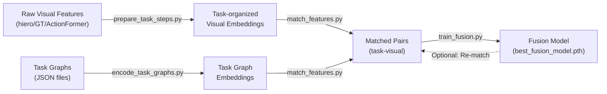

# EgoVLP Task Graph Integration Workflow Guide

This guide explains the complete workflow for integrating task graphs with visual features in the EgoVLP project. The pipeline consists of four main scripts that work together to create a unified representation of task structures and visual observations.

## Table of Contents
1. [Overview & Architecture](#overview--architecture)
2. [Script 1: prepare_task_steps.py](#script-1-prepare_task_stepspy)
3. [Script 2: encode_task_graphs.py](#script-2-encode_task_graphspy)
4. [Script 3: match_features.py](#script-3-match_featurespy)
5. [Script 4: train_fusion.py](#script-4-train_fusionpy)
6. [Complete Workflow Pipeline](#complete-workflow-pipeline)

---

## Overview & Architecture

The workflow follows a **multimodal fusion pipeline** that:
1. **Prepares** visual features from videos organized by task
2. **Encodes** task graph descriptions to semantic embeddings
3. **Matches** task graph nodes with visual steps using Hungarian algorithm
4. **Trains** a fusion module to combine task and visual information

### Data Flow Diagram
```
Annotations + Visual Features → prepare_task_steps.py → Task-organized embeddings
                                                          ↓
Task Graphs + Pretrained Model → encode_task_graphs.py → Task embeddings
                                                          ↓
Task embeddings + Visual embeddings → match_features.py → Matched pairs + Fused embeddings
                                                          ↓
Matched pairs → train_fusion.py → Trained fusion model
```

---

## Script 1: prepare_task_steps.py

### Purpose
This script reorganizes visual feature embeddings from different extraction sources (hierarchical features, ground truth, ActionFormer) and groups them by task. It bridges the gap between raw visual features and task-level semantic organization.

### Key Concepts

#### Task Normalization
```python
def normalize_task_name(activity_name):
    return str(activity_name).lower().replace(" ", "")
```
Converts activity names from annotations into consistent task identifiers (e.g., "Making Tea" → "makingtea")

#### Error Labeling
- Extracts binary labels from annotations: whether a recording contains erroneous steps
- `has_error_step()` returns 1 if any step in a video has errors, 0 otherwise

### Supported Input Formats

#### 1. **HIERO Format** (Hierarchical features)
- **Input files:**
  - Step metadata: `visual_features/hiero_results.json` (contains step boundaries and IDs)
  - Embeddings: `visual_features/hiero_embeddings.npz` (raw feature vectors)
  - Annotations: `annotations/annotation_json/complete_step_annotations.json`
  
- **Process:**
  - Loads embedding vectors for each recording
  - Groups embeddings by task using activity names from annotations
  - Tracks which recording → task mapping for later reference
  - Collects statistics (total steps, correct/incorrect steps per task)

#### 2. **GT (Ground Truth) Format**
- **Input files:**
  - GT features: `visual_features/gt-steps.npz` (one step per frame averaged)
  - Annotations: Complete step annotations
  
- **Process:**
  - Handles two possible GT storage formats:
    - **Legacy:** `step_{i}_features`, `step_{i}_recording_id`, etc. keys
    - **Per-recording:** Each key is a recording_id with shape (num_steps, dim)
  - Averages frame-level features to get per-step embeddings
  - Links steps to descriptions from annotations

#### 3. **ActionFormer Format**
- **Input files:**
  - Step metadata: `visual_features/actionformer_steps.json`
  - Embeddings: `visual_features/actionformer_steps.npz`
  
- **Process:**
  - Similar to HIERO but uses ActionFormer-specific metadata
  - Each row in embeddings corresponds to one step

### Main Aggregation Process

#### `aggregate_hiero_steps()` Function
```
Input: annotations, step_metadata, embeddings
Output: reorganized_features (dict of task → embeddings), metadata (recording mappings)

Steps:
1. Iterate through all recordings in embeddings
2. Look up task name from annotations using recording_id
3. Determine if recording has errors (video-level label)
4. Extract step embeddings and metadata
5. Concatenate all recordings for each task
6. Return task→embeddings mapping + metadata
```

### Output Format

**Output Files:**
- `task_embeddings.npz` - Numpy archive containing:
  - Keys: normalized task names (e.g., "makingtea")
  - Values: (num_steps, embedding_dim) arrays of concatenated step embeddings
  
- `visual_features_mapping.json` - Metadata containing:
  ```json
  {
    "video_to_task": {"0": "makingtea", "1": "makingtea", ...},
    "video_to_label": {"0": 0, "1": 1, ...},  // 0 = correct, 1 = has errors
    "task_step_metadata": {
      "makingtea": [
        {
          "recording_id": "ego_video_001",
          "video_idx": 0,
          "step_idx_in_video": 0,
          "label": 0,
          "step_id": 5,
          ...
        },
        ...
      ]
    },
    "task_stats": {
      "makingtea": {
        "total_steps": 150,
        "correct_steps": 120,
        "incorrect_steps": 30
      }
    }
  }
  ```

### Usage Example
```bash
python prepare_task_steps.py \
  --source hiero \
  --annotations annotations/annotation_json/complete_step_annotations.json \
  --step_metadata visual_features/hiero_results.json \
  --embeddings visual_features/hiero_embeddings.npz \
  --out_npz visual_features/hiero_step_embeddings_256.npz \
  --out_json visual_features/hiero_visual_features_mapping.json
```

---

## Script 2: encode_task_graphs.py

### Purpose
This script encodes textual descriptions of task graph nodes (steps) into fixed-dimensional embedding vectors using a pre-trained EgoVLP text encoder. It creates semantic representations of what each task step is supposed to accomplish.

### Key Concepts

#### Task Graph Structure
Task graphs are JSON files where each task contains:
```json
{
  "steps": {
    "1": "pick up kettle",
    "2": "fill kettle with water",
    "3": "turn on kettle",
    ...
    "START": "START",
    "END": "END"
  },
  "edges": [
    {"from": "START", "to": "1"},
    {"from": "1", "to": "2"},
    ...
  ]
}
```

#### EgoVLP Text Encoder
- Uses a pre-trained CLIP-style encoder (DistilBERT for text)
- Maps textual step descriptions to 256D (or configurable) embedding space
- Model path: `pretrained/egovlp.pth`

### Main Process Flow

#### 1. **Load Task Graphs**
```python
def load_task_graphs(task_graphs_dir):
    # For each task JSON file:
    # 1. Extract step descriptions (skip START/END)
    # 2. Add "#C C" prefix (how EgoVLP was trained)
    # 3. Create mapping: task_name → descriptions
```
**Output:** Dictionary mapping task names to description lists

#### 2. **Initialize EgoVLP Model**
```
Steps:
1. Load configuration (architecture, text model type)
2. Create model instance (FrozenInTime) with:
   - Video encoder: SpaceTimeTransformer (unused for this task)
   - Text encoder: DistilBERT-base-uncased
   - Projection layer: projects to output_dim (256)
3. Load pre-trained checkpoint
4. Move to GPU/CPU
```

#### 3. **Encode Text Descriptions**
```python
def encode_texts(model, tokenizer, texts, device, batch_size=32):
    # Process texts in batches to save memory:
    for batch in batches:
        1. Tokenize texts using DistilBERT tokenizer
           - Padding and truncation to 77 tokens (CLIP standard)
        2. Forward through text encoder
        3. Collect embeddings (num_texts, embedding_dim)
    return concatenated_embeddings
```

**Key parameters:**
- `max_length=77`: Standard CLIP max sequence length
- `batch_size=32`: Process 32 descriptions at a time (memory efficient)
- Output: (num_steps, 256) embedding matrix per task

### Output Format

**Output Files:**
- `task_graph_embeddings.npz` - Numpy archive with:
  - Keys: task names (e.g., "makingtea")
  - Values: (num_steps, embedding_dim) arrays
  
- `task_graph_metadata.json` - Metadata containing:
  ```json
  {
    "makingtea": {
      "descriptions": ["#C C pick up kettle", "#C C fill with water", ...],
      "steps": {"1": "pick up kettle", "2": "fill with water", ...},
      "edges": [{"from": "START", "to": "1"}, ...],
      "embedding_shape": [5, 256]
    }
  }
  ```

### Usage Example
```bash
python encode_task_graphs.py \
  --checkpoint pretrained/egovlp.pth \
  --task_graphs_dir annotations/task_graphs \
  --output_dir outputs/task_graph_encodings_256 \
  --embedding_dim 256 \
  --batch_size 32
```

### Important Details
- The "#C C" prefix is crucial - it matches the training format of EgoVLP
- Descriptions should be clean, action-oriented phrases
- Output embeddings are in the same vector space as visual features (256D)

---

## Script 3: match_features.py

### Purpose
This script matches task graph nodes (steps) with visual steps from recordings using the **Hungarian algorithm**. It establishes correspondences between what the task prescribes and what was actually observed in videos, enabling the training of fusion models.

### Key Concepts

#### Hungarian Algorithm for Matching
The Hungarian algorithm solves the **assignment problem**: optimally match N task nodes to M visual steps by maximizing total similarity.

**Why Hungarian matching?**
- Finds globally optimal one-to-one assignments
- Handles unequal numbers of task nodes and visual steps
- Each task node matches at most one visual step (and vice versa)

### Main Process Flow

#### 1. **Load Embeddings**
```
Inputs:
  - Task graph embeddings: (num_task_nodes, 256)
  - Visual embeddings: (num_visual_steps, 256)
  - Metadata: recording → task mapping
```

#### 2. **Build Similarity Matrix**
```python
def compute_similarity_matrix(embeddings_a, embeddings_b, metric='cosine'):
    # For each task node i and visual step j:
    similarity[i,j] = cos_sim(task_emb[i], visual_emb[j])
    
    # Higher similarity = better match
```

**Metrics supported:**
- **Cosine similarity**: normalized embedding dot product
  - Range: [-1, 1], where 1 is perfect match
- **Euclidean distance**: negative L2 distance
  - More sensitive to small differences

#### 3. **Hungarian Matching Per Recording**
```
For each recording in task:
  1. Get visual embeddings for that recording
  2. Compute similarity(task_nodes, recording_visual_steps)
  3. Run Hungarian algorithm:
     - Convert similarity → cost (negative for minimization)
     - Find optimal assignments
  4. Identify unmatched:
     - Task nodes with no match
     - Visual steps with no match
```

#### 4. **Apply Fusion Model (Optional)**
If a trained fusion model is provided:
```python
def fuse_pair(model, task_embedding, visual_embedding, device):
    # For each matched pair:
    fused = model(task_emb, visual_emb)  # (256,) output
    # Use fused embedding for downstream tasks
```

### Output Format

**Output Files:**

1. **`matched_pairs.json`** - Human-readable JSON:
   ```json
   [
     {
       "task_name": "makingtea",
       "task_idx": 0,
       "visual_idx": 15,
       "recording_id": "ego_video_001",
       "task_embedding": [0.1, 0.2, ...],  // 256 values
       "visual_embedding": [0.15, 0.25, ...],  // 256 values
       "fused_embedding": [0.12, 0.22, ...],  // if fusion model used
       "similarity": 0.87,
       "description": "#C C pick up kettle",
       "video_label": 0,
       "step_idx_in_video": 5
     },
     ...
   ]
   ```

2. **`matches.pkl`** - Binary pickle with detailed matching info:
   ```
   {
     "makingtea": {
       "recordings": {
         "ego_video_001": {
           "matches": [(0, 15), (1, 16), ...],  // (task_idx, visual_idx)
           "unmatched_task": [3, 5],
           "unmatched_visual": [8, 12],
           "num_matches": 5
         }
       },
       "unmatched_task": [3, 5],
       "unmatched_visual": [8, 12, 20]
     }
   }
   ```

3. **`matching_summary.json`** - Statistics:
   ```json
   {
     "total_tasks": 12,
     "total_matches": 1500,
     "matching_metric": "cosine",
     "per_task_stats": {
       "makingtea": {
         "num_matches": 125,
         "num_unmatched_task": 2,
         "num_unmatched_visual": 8
       }
     }
   }
   ```

4. **`updated_task_graph_embeddings.npz`** (optional):
   - Updated task embeddings after fusion with visual features
   - Can be used as new task representations

5. **`recording_metadata.json`** (optional):
   - Per-recording metadata for matched pairs

### Usage Example
```bash
python match_features.py \
  --task_graph_embeddings outputs/task_graph_encodings_256/task_graph_embeddings.npz \
  --visual_features visual_features/hiero_step_embeddings_256.npz \
  --visual_metadata visual_features/hiero_visual_features_mapping.json \
  --metadata outputs/task_graph_encodings_256/task_graph_metadata.json \
  --output_dir outputs/matched_features \
  --matching_metric cosine \
  --embedding_dim 256
```

### With Fusion Model
```bash
python match_features.py \
  --task_graph_embeddings outputs/task_graph_encodings_256/task_graph_embeddings.npz \
  --visual_features visual_features/hiero_step_embeddings_256.npz \
  --metadata outputs/task_graph_encodings_256/task_graph_metadata.json \
  --fusion_checkpoint outputs/fusion_model/best_fusion_model.pth \
  --output_dir outputs/matched_features_fused \
  --embedding_dim 256
```

### Key Design Decisions
- **Per-recording matching**: Matches are done separately for each recording, then aggregated
- **Task preservation**: Updating embeddings with fusion doesn't break task structure
- **Flexible metrics**: Supports both cosine and Euclidean distances
- **Unmatched tracking**: Records which nodes/steps couldn't be matched for analysis

---

## Script 4: train_fusion.py

### Purpose
This script trains a learnable **FeatureFusionModule** that combines task graph and visual embeddings. The fusion model learns to create unified representations that preserve information from both modalities.

### Key Components

#### 1. **FeatureFusionModule Architecture**
The module supports three fusion strategies:

**A. Concatenation + MLP** (default)
```
Input: task_features (256,) + visual_features (256,)
         ↓
  Concatenate → [task_features, visual_features] = (512,)
         ↓
  Linear(512 → 512) + ReLU + Dropout(0.1)
         ↓
  Linear(512 → 256)
         ↓
  LayerNorm
         ↓
  Output: fused_features (256,)
```

**B. Cross-Attention**
```
Task features attend to visual features:
  - Query = Linear(task) → (256,)
  - Key = Linear(visual) → (256,)
  - Value = Linear(visual) → (256,)
  - Attention = softmax((Q @ K.T) / sqrt(256)) @ V
  - Output = LayerNorm(Linear(attention))
```

**C. Gated Fusion**
```
Gate = sigmoid(Linear([task, visual]) → (256,))
       ↓
Fused = Gate * task_features + (1 - Gate) * visual_features
        ↓
Output = LayerNorm(Linear(fused))
```

#### 2. **Loss Function: Contrastive Loss**
```python
def contrastive_loss(fused, task, visual, temperature=0.07):
    # Normalize all embeddings to unit hypersphere
    fused_norm = normalize(fused)
    task_norm = normalize(task)
    visual_norm = normalize(visual)
    
    # Compute dot-product similarities
    sim_task = (fused_norm · task_norm) / temperature
    sim_visual = (fused_norm · visual_norm) / temperature
    
    # Loss: maximize similarity to both inputs
    loss = -mean(sim_task + sim_visual)
    return loss
```

**Intuition:**
- Fused embeddings should be similar to both input embeddings
- Temperature parameter controls the sharpness of the similarity distribution
- Prevents feature collapse while maintaining alignment

#### 3. **MatchedPairsDataset**
```python
class MatchedPairsDataset(Dataset):
    # Wraps matched pairs from match_features.py
    # Returns: {'task_embedding', 'visual_embedding', 'task_name', ...}
```

### Training Process

#### 1. **Data Preparation**
```
Input: matched_pairs.json from match_features.py
  ↓
Split: train_split=0.8 → train_pairs (80%) + val_pairs (20%)
  ↓
Create DataLoaders with batch_size=32
```

#### 2. **Training Loop** (per epoch)
```
For each batch in train_loader:
  1. Get task_embedding, visual_embedding from batch
  2. Forward: fused = model(task_emb, visual_emb)
  3. Compute contrastive_loss(fused, task_emb, visual_emb)
  4. Backward: loss.backward()
  5. Update: optimizer.step()
  
Return: average loss over all batches
```

#### 3. **Validation Loop** (per epoch)
```
Same as training but:
- No parameter updates
- No gradients computed (torch.no_grad())
- Used for model selection and learning rate scheduling
```

#### 4. **Learning Rate Scheduling**
```
ReduceLROnPlateau:
  - Monitor validation loss
  - If loss doesn't improve for 5 epochs:
    - Reduce learning rate by factor of 0.5
```

#### 5. **Model Checkpointing**
```
During training:
  - Save best_fusion_model.pth when val_loss improves
  - Save final_fusion_model.pth after all epochs
  
Checkpoint contains:
  - model_state_dict: weights for loading
  - optimizer_state_dict: for resuming training
  - args: hyperparameters used
  - embedding_dim: for sanity checks
```

### Hyperparameters

| Parameter | Default | Description |
|-----------|---------|-------------|
| `batch_size` | 32 | Samples per batch |
| `num_epochs` | 50 | Total training epochs |
| `learning_rate` | 1e-4 | Adam learning rate |
| `weight_decay` | 1e-5 | L2 regularization |
| `temperature` | 0.07 | Contrastive loss temperature |
| `hidden_dim` | 512 | MLP hidden dimension (concat only) |
| `output_dim` | 256 | Output embedding dimension |
| `fusion_type` | 'concat' | 'concat' \| 'cross_attention' \| 'gated' |
| `train_split` | 0.8 | Fraction for training |

### Output Format

**Checkpoint Files:**

1. **`best_fusion_model.pth`**
   - Model with lowest validation loss
   - Recommended for inference

2. **`final_fusion_model.pth`**
   - Model after all epochs
   - Useful for residual training

**Checkpoint Contents:**
```python
{
    'epoch': 25,
    'model_state_dict': {...},  # torch.nn.Module weights
    'optimizer_state_dict': {...},  # Adam state
    'train_loss': 0.1234,
    'val_loss': 0.1456,
    'args': {
        'batch_size': 32,
        'learning_rate': 1e-4,
        'fusion_type': 'concat',
        ...
    },
    'embedding_dim': 256
}
```

### Usage Example

```bash
# After running match_features.py to generate matched_pairs.json
python train_fusion.py \
  --matched_pairs outputs/matched_features/matched_pairs.json \
  --output_dir outputs/fusion_model \
  --fusion_type concat \
  --hidden_dim 512 \
  --output_dim 256 \
  --batch_size 32 \
  --num_epochs 50 \
  --learning_rate 1e-4 \
  --temperature 0.07 \
  --train_split 0.8
```

### Key Design Decisions

1. **Contrastive Loss**: Encourages the fused representation to preserve information from both modalities
2. **Layer Normalization**: Stabilizes training and prevents gradient explosion
3. **Dropout**: Prevents overfitting (0.1 rate in concat fusion)
4. **Adam Optimizer**: Adaptive learning rates per parameter
5. **LR Scheduling**: Gradually reduce learning rate if stuck at local minimum

---

## Complete Workflow Pipeline

### End-to-End Execution



### Step-by-Step Execution

#### Phase 1: Feature Preparation (Script 1)
```bash
# For HIERO features
python prepare_task_steps.py \
  --source hiero \
  --annotations annotations/annotation_json/complete_step_annotations.json \
  --step_metadata visual_features/hiero_results.json \
  --embeddings visual_features/hiero_embeddings.npz \
  --out_npz visual_features/hiero_step_embeddings_256.npz \
  --out_json visual_features/hiero_visual_features_mapping.json
```

**Output:** Task-organized embeddings and metadata

#### Phase 2: Task Graph Encoding (Script 2)
```bash
python encode_task_graphs.py \
  --checkpoint pretrained/egovlp.pth \
  --task_graphs_dir annotations/task_graphs \
  --output_dir outputs/task_graph_encodings_256 \
  --embedding_dim 256
```

**Output:** Task graph embeddings with descriptions

#### Phase 3: Matching (Script 3)
```bash
python match_features.py \
  --task_graph_embeddings outputs/task_graph_encodings_256/task_graph_embeddings.npz \
  --visual_features visual_features/hiero_step_embeddings_256.npz \
  --metadata outputs/task_graph_encodings_256/task_graph_metadata.json \
  --output_dir outputs/matched_features \
  --embedding_dim 256
```

**Output:** Matched pairs JSON and matching statistics

#### Phase 4: Fusion Training (Script 4)
```bash
python train_fusion.py \
  --matched_pairs outputs/matched_features/matched_pairs.json \
  --output_dir outputs/fusion_model \
  --fusion_type concat \
  --num_epochs 50 \
  --learning_rate 1e-4
```

**Output:** Trained fusion model checkpoint

### Optional: Iterative Refinement

After training the fusion model, you can re-run matching with the updated model to generate improved embeddings:

```bash
python match_features.py \
  --task_graph_embeddings outputs/task_graph_encodings_256/task_graph_embeddings.npz \
  --visual_features visual_features/hiero_step_embeddings_256.npz \
  --metadata outputs/task_graph_encodings_256/task_graph_metadata.json \
  --fusion_checkpoint outputs/fusion_model/best_fusion_model.pth \
  --output_dir outputs/matched_features_fused \
  --embedding_dim 256
```

This generates fused embeddings that can be used for:
- Better downstream task understanding
- Improved action localization
- Video-task alignment verification

---

## Key Insights

### Design Philosophy
1. **Modular Pipeline**: Each script solves one problem independently
2. **Embedding Alignment**: All embeddings are in the same 256D space
3. **Metadata Preservation**: Rich metadata maintained throughout pipeline
4. **Flexibility**: Supports multiple visual feature sources
5. **Learnable Fusion**: Task-visual compatibility learned from data, not hand-crafted

### Common Pitfalls

1. **Dimension Mismatch**: Ensure task and visual embeddings have same dimensions
2. **Task Name Normalization**: Task names must match exactly between scripts
3. **Missing Metadata**: Verify visual_features_mapping.json exists before matching
4. **Batch Size**: Reduce if GPU OOM errors during fusion training
5. **Temperature Tuning**: Too small → numerical issues; too large → weak learning signal

### Performance Considerations

| Bottleneck | Solution |
|-----------|----------|
| Slow text encoding | Increase batch_size (if GPU memory allows) |
| Slow matching | Pre-compute similarity matrices in parallel |
| Poor fusion performance | Try different fusion_type or increase num_epochs |
| GPU memory | Reduce batch_size in train_fusion.py |
| I/O bottlenecks | Use SSD for visual features file |

---

## Conclusion

This four-script pipeline creates a unified task-visual representation by:
1. **Organizing** raw visual features by task
2. **Encoding** task structures into semantic embeddings
3. **Matching** task nodes to visual observations
4. **Fusing** information from both modalities

The result is a model that understands both what tasks prescribe and what actually happens in videos, enabling robust task understanding and error detection in ego-centric vision.
